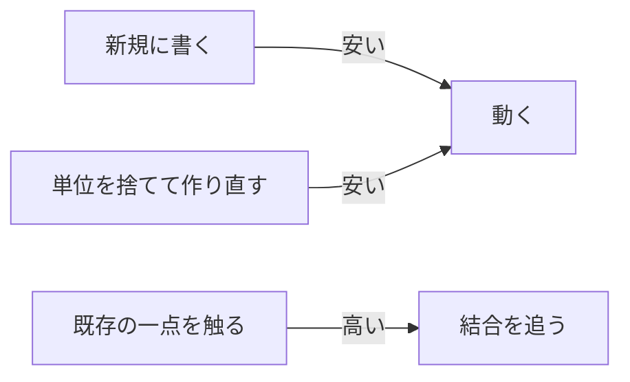

# はじめに

新しい品質特性は Deletable だ。正しく動く、速く動く、壊れない、直せる、の次に来るのは、**捨てられること**である。

自分は RTX 5090 のマシンで llama.cpp を回して、エージェントにコードを書かせている。新規のファイルはすぐ出る。既存の一点を触らせると、結合を読み違えて壊す。この非対称を、ツールの未熟さとして待つ話にしたくない。ソフトウェア側の品質の話にしたい。

> Deletable とは、単位を丸ごと捨てて作り直せる性質のことだ。

途中を「ちょっと直す」前提で組まれたものは、いま一番高い作業を人間と AI の両方に強制する。それが品質特性になる理由だ。

:::message
ISO/IEC 25010:2023 は製品品質を9特性に分けている。最後に足されたのは安全性（Safety）で、壊れたときの危害は入った。残ったときの危害は、まだ無い。
:::

# なぜ保守性の下に置かないか

直せることは、すでに保守性として測られている。Deletable をそこに足すと、終わらせ方が「直しやすさ」に吸収されて消える。

保守性は直し続ける前提だ。柔軟性は別環境で生き続ける前提、セキュリティは守る前提。終わらせる操作は、どの前提にも乗らない。

Joel Spolsky が全面書き換えを戒めたのは、人間が暗黙知を失う前提だった。再生成が安くなったいまも、システムごと作り直すのは死ぬ。ここで言うのはビッグバンではない。関数、モジュール、シート、スキル、そういう単位ごとに捨てて入れ直すことだ。

測るなら、二つで足りる。

1. 単位を消したとき、再生成に必要な核は明示されているか
2. 途中の変更が、後ろを捨てて作り直す以外の経路を要求しないか

前者は設計、後者は実行時の形だ。

# 安い操作と高い操作

生成 AI は足すのが安い。既存の一点を触って波及を読むのが高い。だから進化の安い経路は、捨てて作り直すほうへ寄る。



関数型の immutable が効くのも、この線だ。更新は新しい値を返す。元の値は残る。`f(x)` のあと `x` が同じ物かを、`f` の中まで見なくてよい。

これを「AI は Haskell が得意」と書くと外れる。生成の流暢さは訓練データの話で、純粋関数型はベンチではむしろ弱いことがある。捨てて差し替えられる形の話と、生成の上手さは別だ。

# 同じ失敗が、別の場所にもある

業務フローに埋め込まれた Excel をエンジニアが嫌ったのは、UI の話ではない。セルは上書きされ、誰が参照しているかは別シートの先まで見ないと分からない。ファイルは消せる。真実がそこしか無いなら、システムとしては消せない。作るのは安い、触るのは高い。AI と同じ形だ。

推論も同じ制約で動いている。各トークンの Key / Value は、それより前全部に条件付きだ。生成は末尾に足すだけ。途中をいじると、そこから先は全部無効になる。llama.cpp は共通の先頭を残し、後ろを切って計算し直す。プロンプト先頭を少しいじるとキャッシュが死ぬのは、変化が末尾以外に漏れた失敗だ。LLM 自身が、足すか、分岐点から捨てるか、以外の進化経路を持っていない。

```
token   0  1  2  3  4  5  6  7
cache   [==== 残せる prefix ====][ 捨てる suffix ]
                                 ↑ ここから切って再計算
```

スキルも prefix だ。しゅうへい氏が [GPT-6 Astra](https://x.com/shupeiman/article/2096565809556681138) について書いていたのは、細かく入れるほど動きが悪くなる、という一行だった。古いモデルのギャップを埋めた手順は、ギャップがモデル側に吸われた瞬間、先頭の汚染になる。ファイルは消せる。『うちのやり方』として核に昇格しているから、消せない。

モデルが推論できる手順は書いてはいけない。書くのは、目的、制約、この環境だけの事実だけだ。対象モデルが消えたときに一緒に消せるスキルだけが、次のモデルに対して欠陥にならない。

# 全部消すと、傷まで消える

だから対になる命題が要る。捨ててよい本体と、消してはいけない核。

| 残す核 | 捨ててよい本体 |
| --- | --- |
| テスト、契約、失敗の記録 | 実装 |
| ソースデータ | Excel のシート |
| 安定した prefix | KV の suffix |
| 目的・制約・環境の事実 | スキルの手順 |

Event sourcing のログが消せないことと矛盾しない。ログは核だ。投影は捨てて再構築する。核が残っているから、捨てて再生成しても品質が戻る。

足すのが飽和したあとに残るのは、消せないものだけだ。
